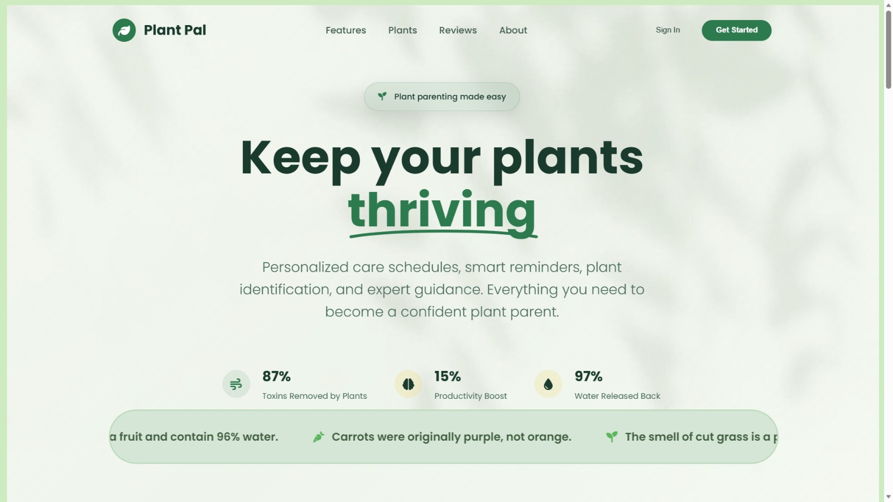

<div align="center">

  
  
  # 🌱 Plant Pal
  
  **Your Virtual Plant Care Assistant**

  <a href="https://git.io/typing-svg">
    
  </a>

  <p align="center">
    A modern full-stack web application designed to help users discover plants, understand their care needs,
    and manage their personal digital garden — all in one beautiful interface.
  </p>

  <p align="center">
    
    
    
    
    
  </p>

</div>

---

## 📸 Project Preview

> A lush, green UI with smooth animations, a hero video background, interactive plant cards,
> and a personalized garden dashboard.

<p align="center">
  
</p>

---

## 🌟 Features

### 🌿 Core Functionality
- **Dynamic Plant Catalogue**
  - Fetched from MySQL using PHP APIs
  - Animated plant cards with images, difficulty badges, watering & light info
- **My Garden Dashboard**
  - Logged-in users can add plants to their personal collection
  - Persistent storage using relational tables
- **Detailed Care Guides**
  - Separate HTML pages for each plant  
    *(Money Plant, Aloe Vera, Tulsi, Snake Plant, ZZ Plant, etc.)*
- **Plant Facts Ticker**
  - Infinite scrolling marquee
  - Randomized using Fisher-Yates shuffle algorithm

### 🎨 UI / UX Excellence
- Glassmorphism modals (Sign In / Sign Up)
- Hero section with **video background**
- Smooth scroll navigation
- IntersectionObserver-based animations
- Responsive grid layouts (Desktop → Mobile)

### 🔐 Authentication & Security
- PHP **session-based authentication**
- Secure Sign Up & Sign In APIs
- SQL **prepared statements** (Injection-safe)
- Login-aware UI (dynamic navbar switch)

---

## 🗂 Project Structure

```text
```bash
plant-pal/
├── asset/
│   ├── animation.webm       # Hero section video
│   ├── plant_images/        # JPG/PNGs for the catalogue
│   └── ...
├── care_*.html              # Individual care pages (Aloe, Tulsi, etc.)
├── frontpage.html           # 🏠 Main Entry Point
├── style.css                # 🎨 Global Styles & Variables
├── app.js                   # ⚡ Frontend Logic (Modals, Fetch, UI)
├── db_connect.php           # 🔌 Database Connection Config
├── signup.php               # 📝 Registration Endpoint
├── signin.php               # 🔑 Login Endpoint
├── get_plants.php           # 📥 API: Fetch Catalogue
├── add_my_plant.php         # ➕ API: Add to User Garden
├── get_my_plants.php        # 📤 API: Fetch User Garden
└── README.md
```
## 🛠 Tech Stack

| Layer | Technologies |
|------|--------------|
| **Frontend** | HTML5, CSS3 (Flexbox, Grid, Animations), JavaScript (ES6+, Fetch API) |
| **Backend** | PHP (Sessions, REST-style APIs) |
| **Database** | MySQL |
| **Design** | Font Awesome, Google Fonts (Poppins) |
| **UX / Animations** | IntersectionObserver, CSS transitions, marquee animations |

---

## 🗃 Database Schema

### 👤 users
| Column | Type |
|------|------|
| id | INT (PK) |
| username | VARCHAR |
| email | VARCHAR |
| password | VARCHAR (hashed) |
| location | VARCHAR |

### 🌿 plants
| Column | Type |
|------|------|
| id | INT (PK) |
| name | VARCHAR |
| scientific_name | VARCHAR |
| image_url | TEXT |
| watering | VARCHAR |
| light | VARCHAR |
| care_level | VARCHAR |

### 🪴 my_plants
| Column | Type |
|------|------|
| id | INT (PK) |
| user_id | INT (FK) |
| plant_id | INT (FK) |
| added_date | DATE |

---

## 🔌 API Endpoints

| Endpoint | Method | Description |
|--------|--------|-------------|
| `/signup.php` | POST | Create new user |
| `/signin.php` | POST | Authenticate user |
| `/get_plants.php` | GET | Fetch all plants |
| `/add_my_plant.php` | POST | Add plant to user's garden |
| `/get_my_plants.php` | GET | Fetch user's plants |

---

## ⚙ Installation & Setup

### 1️⃣ Clone Repository
```bash
git clone https://github.com/your-username/plant-pal.git
```
### 2️⃣ Setup Database

- Import the SQL schema into **MySQL**
- Update database credentials in `db_connect.php`

```php
define('DB_SERVER', 'localhost');
define('DB_USERNAME', 'root');
define('DB_PASSWORD', 'your_password');
define('DB_NAME', 'plant_pal_db');
```
### 3️⃣ Run Project

- Use **XAMPP / WAMP / MAMP**
- Place the project folder inside `htdocs`
- Open in browser:

```text
http://localhost/plant-pal/frontpage.html
```
## 🚀 Future Roadmap

- 🌦 Weather-based watering tips (OpenWeather API)
- ⏰ Smart plant care reminders
- 📸 Plant identification via image upload
- 📊 Growth tracking dashboard
- 🗑 Remove plants from *My Garden*
- 🧑‍💼 Admin panel for plant management
- 🔐 JWT-based authentication
- 📱 Progressive Web App (PWA)

---

## 👨‍💻 Contributors

[Shivansh Chaturvedi](https://github.com/shivanshh-oo)

[Prateek Singh](https://github.com/PrateekSinghThakur)

[Ayush Chhabra](https://github.com/ayushchhabra30)


